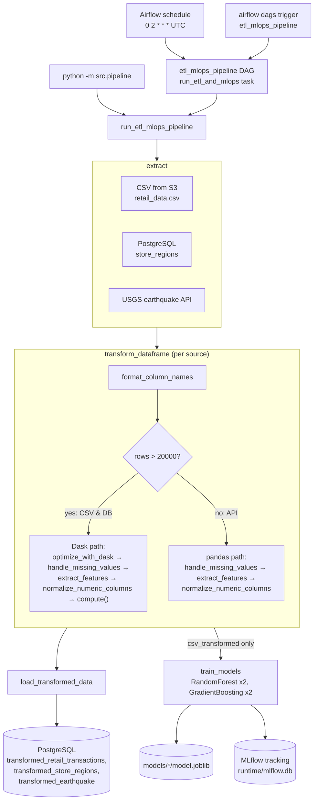
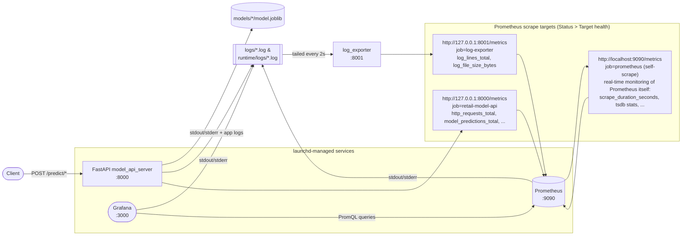

# ETL and MLOps Pipeline

## 1. Project Layout

- `src/`: ETL phases, model training, FastAPI model server, and the log exporter.
- `dags/`: Airflow scheduling definitions.
- `config/`: Prometheus and Grafana configuration.
- `deployment/launchd/`: macOS service definitions.
- `db/`: database schema.
- `tests/`: API test client.
- `.env.example`: template for local environment variables; copy it to an untracked `.env` file.
- `data/`, `models/`, `logs/`, `mlruns/`, and `*-data/`: local data or runtime artifacts.

## 2. Architecture

### 2.1 Pipeline Execution

`src/pipeline.py` runs the same extract → transform → load → train workflow whether it's invoked
directly or through Airflow. Each source is transformed independently in `transform_dataframe`,
which always formats column names first, then branches: the larger CSV and database sources go
through a Dask-parallelized path once `len(df) > 20000`, while the smaller API source stays on
plain pandas. All three transformed frames are persisted back to PostgreSQL, but only
`csv_transformed` is passed on to `train_models`.



### 2.2 Serving and Monitoring

The model API, Prometheus, and Grafana all run as launchd services and write their stdout/stderr
into `logs/` or `runtime/logs/`. `log_exporter` tails those files and turns them into metrics
alongside the counters the API exposes directly. Prometheus scrapes three targets in total
(`config/prometheus.yml`), matching **Status > Target health**: `retail-model-api` and
`log-exporter` for the deployed model and its logs, plus a `prometheus` self-scrape for real-time
monitoring of Prometheus's own engine (scrape durations, TSDB stats, etc.) at
`http://localhost:9090/metrics`.



### 2.3 Explore Metrics in Grafana

Open `http://localhost:3000` and use **Drilldown > Metrics** to browse everything the single
`Prometheus` data source (`http://127.0.0.1:9090`, provisioned in
`config/grafana/provisioning/datasources/prometheus.yml`) has scraped. All three jobs from
`config/prometheus.yml` show up together in one list here, so it's worth knowing which job each
metric comes from:

- `http_requests_total`, `http_request_latency_seconds_bucket` — per-request count/latency,
  recorded by the API's middleware (`job="retail-model-api"`).
- `model_predictions_created`/`model_predictions_total` — per-model prediction counts. Drill into
  the metric and add the filter `job="retail-model-api"` to break results down further by
  `model_name` and `status` (`random_forest_100`, `gradient_boosting_200`, etc.).
- `log_lines_total`, `log_file_size_bytes` — from the `log-exporter` job.
- `go_gc_cycles_automatic_gc_cycles_total`, `go_gc_cleanups_*` — Go runtime metrics from
  Prometheus's own self-scrape (`job="prometheus"`); these describe Prometheus itself, not the
  deployed model.

Each panel's **Related metrics**, **Related logs**, and **Query results** tabs let you pivot or
inspect raw label sets without hand-writing PromQL.

## 3. Run the ETL & MLOps Pipeline

### 3.1 Option 1: Run the Pipeline Manually

Set `ROOT_DIR` to the repository root, create the local environment file once, then run commands
from this project directory:

```bash
export ROOT_DIR="$(git rev-parse --show-toplevel)"
source "$ROOT_DIR/.venv/bin/activate"
cd "$ROOT_DIR/DDS-8530/A5"
cp .env.example .env  # Run once, then set DB_PASSWORD in .env.
set -a; source .env; set +a
python -m src.pipeline
```

`.env` is ignored by Git and stores local values without `export` prefixes. `DB_PASSWORD` must be
set when the PostgreSQL load step is enabled.

### 3.2 Option 2: Run Airflow Locally and Schedule the Pipeline
Airflow runs the same pipeline from the `etl_mlops_pipeline` DAG. Start the local Airflow instance:

```bash
export ROOT_DIR="$(git rev-parse --show-toplevel)"
source "$ROOT_DIR/.venv/bin/activate"
cd "$ROOT_DIR/DDS-8530/A5"
set -a; source .env; set +a
export AIRFLOW_HOME="$PWD/airflow"
export AIRFLOW__CORE__DAGS_FOLDER="$PWD/dags"
airflow standalone
```

Open the Airflow UI at `http://127.0.0.1:8080`. The DAG runs on its configured schedule or can be
triggered manually:

```bash
airflow dags trigger etl_mlops_pipeline
```

## 4. Model Deployment and Tracking

### 4.1 Deploy the Model API

The [GitHub Actions workflow](../../../.github/workflows/deploy-local-api.yml) deploys the API on a
self-hosted macOS runner. It runs on pushes to `master` that change the API, model-training code, or
requirements, and can also be started manually with `workflow_dispatch`. The workflow updates the
local checkout, restarts the launchd service, and verifies `http://127.0.0.1:8000/health`.

### 4.2 Run the Model API

The current implementation serves models locally; it can also be deployed to a cloud hosting
environment. To run the local FastAPI server:

```bash
export ROOT_DIR="$(git rev-parse --show-toplevel)"
source "$ROOT_DIR/.venv/bin/activate"
cd "$ROOT_DIR/DDS-8530/A5"
uvicorn src.model_api_server:app --reload
```

The API is available at `http://127.0.0.1:8000`; use `http://127.0.0.1:8000/docs` for interactive
documentation and `http://127.0.0.1:8000/metrics` for Prometheus metrics.

### 4.3 Test the Model API

```bash
export ROOT_DIR="$(git rev-parse --show-toplevel)"
source "$ROOT_DIR/.venv/bin/activate"
cd "$ROOT_DIR/DDS-8530/A5"
python tests/test_client.py
```

The client sends example input to the prediction endpoints and verifies that the trained models
return predictions.

### 4.4 Run MLflow Locally

Start the MLflow UI to inspect versioned model-training runs, parameters, metrics, and artifacts:

```bash
export ROOT_DIR="$(git rev-parse --show-toplevel)"
source "$ROOT_DIR/.venv/bin/activate"
cd "$ROOT_DIR/DDS-8530/A5"
mlflow ui --backend-store-uri sqlite:///runtime/mlflow.db
```

Open MLflow at `http://127.0.0.1:5000`.

## 5. Observability

### 5.1 Run the Log Exporter

```bash
export ROOT_DIR="$(git rev-parse --show-toplevel)"
source "$ROOT_DIR/.venv/bin/activate"
cd "$ROOT_DIR/DDS-8530/A5"
python -m src.log_exporter
```

This supplementary service collects application and service logs in addition to Prometheus's
standard metrics. It tails every `*.log` file under `logs/` and `runtime/logs/`, then exposes
per-file line/level counts and file size at `http://127.0.0.1:8001/metrics` for Prometheus
(`log-exporter` job in `config/prometheus.yml`).

### 5.2 Run Prometheus Locally

```bash
prometheus --config.file config/prometheus.yml --storage.tsdb.path prometheus-data
```

Prometheus is available at `http://127.0.0.1:9090`; inspect scrape targets at
`http://127.0.0.1:9090/targets` and query metrics at `http://127.0.0.1:9090/graph`.

### 5.3 Run Grafana Locally

```bash
grafana server --homepath /opt/homebrew/share/grafana
```

Open Grafana at `http://127.0.0.1:3000` to explore the Prometheus metrics and log-exporter data.
The provisioned Prometheus data source connects to `http://127.0.0.1:9090`.
